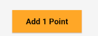
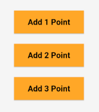
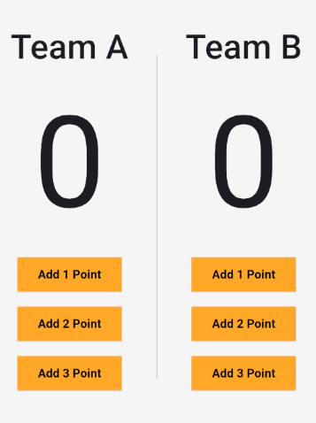
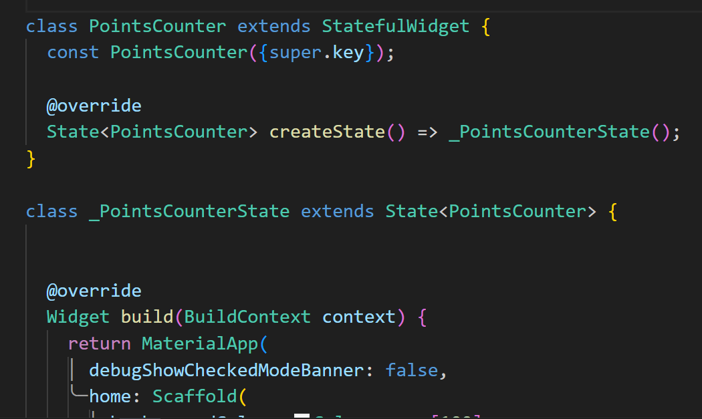

##### debugShowCheckedModeBanner
- Hide the red tape
```
return MaterialApp(
      debugShowCheckedModeBanner: false,
      home: Scaffold()),
```


---
### ElevatedButton :
```
ElevatedButton(
  onPressed: () {},
  style: ElevatedButton.styleFrom(
    backgroundColor: Colors.orange[400],
    minimumSize: const Size(110, 40),
    shape: RoundedRectangleBorder(
      borderRadius: BorderRadius.circular(0),
    ),
  ),
  child: const Text(
    'Add 1 Point',
    style: TextStyle(
        color: Colors.black, fontWeight: FontWeight.w700),
  ),
)
```



---
### SizedBox :
- fixed size between widgets , better than ( Spacer ) widget
```
const SizedBox(
  height: 16
)
```



---
- Putting ( Row ) in ( Column ) and using ( Vertical Divider ), we must specifies the height of the divider
- using ( SizedBox )
```
const SizedBox(
  height: 400,
  child: VerticalDivider(
    thickness: 1,
    indent: 20,
  ),
)
```



---
### anonymous function :
- function used one time in their location
```
onPressed: () {}
```


---
### StatefulWidget :
- Used in case of widget with variable value
- It consists of the widget class (contain @override createState method) and the widget state



### setState
- Change the old state and show the new state (new changes)
```
setState(() {

});
```